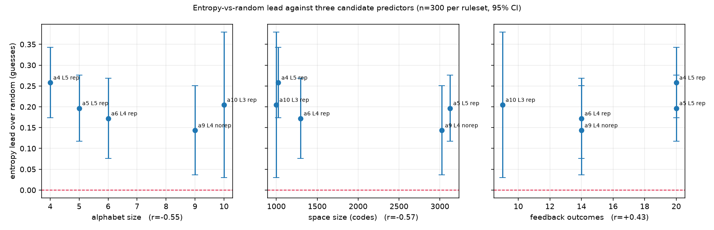

# Guesstimate

A Bulls and Cows solver, game, and research toy.

The secret is a 4-digit number using the digits 1-9, with no zeros and no
repeated digits — exactly 9x8x7x6 = **3024** possible secrets. You think of
one, the solver finds it.

Feedback on a guess is written `+B-C`:

- **B** — digits correct and in the correct position
- **C** — digits present in the secret but in a different position

If the secret is `1234` and the guess is `3264`, the answer is `+2-1`: the `2`
and the `4` are in the right place, the `3` is present but misplaced.

There are 14 distinct feedback outcomes. `+3-1` is not one of them — if three
digits are correctly placed, the fourth has nowhere else to be.

## Status

Rebuild in progress.

The original was written in high school in 2021 by **Akif Celepcikay**. The
2026 rebuild is by **Hakan Celepcikay**.

That original 138-line script is preserved at `legacy/Game.py` and tagged
[`v1.0-original`](../../tree/v1.0-original). It is kept for the record and is
never modified.

| Phase | | |
|---|---|---|
| 0 | Preserve and scaffold | done |
| 1 | The engine | done |
| 2 | Solvers | done |
| 3 | Benchmark suite | in progress |
| 4 | CLI | |
| 5 | Make it fast | |
| 6 | API and game server | |
| 7 | The web app | |
| 8 | Game review | |
| 9 | Shareability | |
| 10 | LLM evaluation | |
| 11 | Ship | |

Build order is in `ROADMAP.md`, feature specs in `FEATURES.md`, visual
direction in `DESIGN.md`.

## Development

Requires [uv](https://docs.astral.sh/uv/).

```sh
make install    # sync dependencies into .venv
make check      # lint + types + tests, the same set CI runs
```

Individual targets: `make lint`, `make fmt`, `make types`, `make test`,
`make test-fast`, `make cov`. Run `make help` for the full list.

## Benchmarks

**Playing well is worth about a sixth of a guess, and that holds on every
ruleset tested — including the classic game.**

Entropy against a random-consistent baseline, 300 paired secrets each, five
rulesets chosen to hold space size roughly constant while trading alphabet size
against code length:

| Ruleset | Codes | Alphabet | Outcomes | Floor | Random | Entropy | Lead | 95% CI |
|---|---|---|---|---|---|---|---|---|
| 5 over `1234`, repeats | 1024 | 4 | 20 | 2.31 | 4.151 | 3.893 | +0.258 | [+0.173, +0.343] |
| 10 symbols, length 3, repeats | 1000 | 10 | 9 | 3.14 | 5.855 | 5.650 | +0.205 | [+0.030, +0.379] |
| 5 over `12345`, repeats | 3125 | 5 | 20 | 2.69 | 4.643 | 4.447 | +0.197 | [+0.117, +0.276] |
| 4 over `123456`, repeats | 1296 | 6 | 14 | 2.72 | 4.675 | 4.503 | +0.172 | [+0.076, +0.268] |
| **classic** 4 over `1-9` | 3024 | 9 | 14 | 3.04 | 5.137 | 4.993 | +0.143 | [+0.036, +0.250] |

<sub>Seed 20260805. Baseline averaged over 5 seeds per secret. Every interval
excludes zero.</sub>

Every solver beats the baseline, everywhere, by between a seventh and a quarter
of a guess. Small, and real.

### What drives the size of the lead

Nothing that could be isolated. Correlations across the five rulesets are
weak — alphabet size −0.55, space size −0.57, feedback outcomes +0.43, the
information floor −0.68 — and with five points none of that is worth reading;
significance at n=5 would need roughly ±0.88.

More decisively, **every pair of confidence intervals overlaps**. The leads
range across 0.115 guesses while a single estimate's half-width is 0.108, so
there is no demonstrated difference between any two rulesets here, let alone a
trend. 

Separating these would need either far more secrets per ruleset or far more
rulesets along one axis with the others pinned. That is a real experiment, not
a bigger version of this one.

### A result this replaced

An earlier reading of two rulesets said strategy was "irrelevant on the classic
game and starts to matter on information-poor rulesets." The grid does not
support it. On the classic game at 100 secrets with a single-seed baseline the
lead measured +0.150 with an interval of [−0.112, +0.412] — not significant, and
read as an absence of effect. At 300 secrets with the baseline averaged over
five seeds it measures +0.143, interval [+0.036, +0.250], significant.

The effect barely moved. The measurement got sharper. What looked like a
finding about the classic game was a statement about the sample size and the
noise in the baseline, and the honest lesson is that a non-significant result at
n=100 is not evidence of no effect — it is a wide interval, and it should be
reported as one rather than converted into a story.

### Running it

```sh
make bench                          # 300 secrets, every solver
make bench ARGS="--sample 50"       # quicker
make bench ARGS="--unrestricted"    # both guessing modes, ~5x slower
make bench ARGS="--full"            # every secret; ~108 min per solver
make bench ARGS="--report-only"     # re-render tables from an existing run
```

Full reports and charts land in [`docs/benchmarks/`](docs/benchmarks/). Three
things the harness insists on:

- **Paired sampling.** Every solver plays the same seeded secrets in the same
  order, and comparisons are per-secret differences rather than differences of
  means. Between two strategies that removes most of the variance; against the
  random baseline it removes almost none, for reasons worth reading in
  [`docs/notes/paired-sampling.md`](docs/notes/paired-sampling.md).
- **Split timings.** The opening move costs ~50s on the classic ruleset and
  every game after it ~2s, so the two are reported separately rather than
  averaged into a per-game figure that describes neither.
- **Provenance.** Every report carries the commit, machine, Python version,
  ruleset, sample size, and seed that produced it. Runs are resumable and refuse
  to append to a file written by a different run.

## License

MIT — see `LICENSE`.
